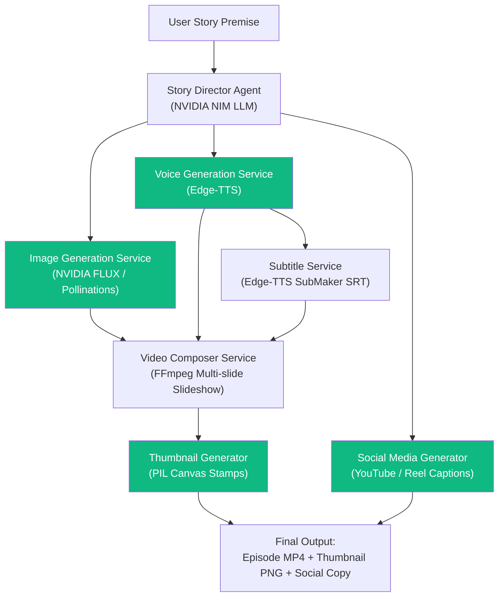

# 🎬 AI Micro-Drama Studio

AI Micro-Drama Studio is a complete MVP that automatically transforms a single-line story premise into a watchable vertical (9:16) short-form drama episode, complete with narration, cinematic images, subtitle captions, high-contrast thumbnail, and ready-to-post social media distribution assets.

**v3.0 — Turbo Pipeline** introduces parallel processing, continue-episode generation, and custom story input.

---

## ✨ Key Features

| Feature | Description |
|---------|-------------|
| **One-Click Episode** | Enter a premise → get a full video with narration, subtitles, thumbnail |
| **⚡ Turbo Pipeline** | Audio + image generation run in parallel; thumbnail + social copy run in parallel |
| **🔄 Continue Episode** | Generate a sequel from any episode's cliffhanger with one click |
| **📖 Custom Story Input** | Paste your own structured story JSON to skip the LLM entirely |
| **🌍 17 Languages** | English, Hindi, Spanish, French, German, Japanese, Korean, Arabic, Portuguese, Chinese, Italian, Russian, Turkish, Bengali, Tamil, Telugu, Urdu |
| **🎨 7 Visual Styles** | Cinematic, Anime, Cyberpunk, Dark Fantasy, Photorealistic, Noir, Watercolor |
| **📱 Social Media Pack** | Auto-generated YouTube/Reels/Instagram titles, captions, and hashtags |

---

## 🏗️ Architecture Workflow

The studio orchestrates several specialized AI services and media processing utilities.

**v3.0 Turbo** runs independent pipeline branches concurrently for up to **2× faster** generation:



> Green nodes run in **parallel** with each other for maximum speed.

---

## 🛠️ Tech Stack & Services

| Component | Technology | Details |
|-----------|-----------|---------|
| **Backend** | FastAPI | Python 3.11+, Async execution, Pydantic v2 validation |
| **Frontend** | Streamlit | Premium glassmorphism dark UI, real-time progress, episode library |
| **Story Generation** | NVIDIA NIM | `meta/llama-3.3-70b-instruct` (with mock fallback) |
| **Voice Narration** | Edge-TTS | Free, keyless, 17-language neural voices |
| **Subtitle Generation** | Edge-TTS SubMaker | Word-boundary timing (SRT), with duration-proportional fallback |
| **Image Generation** | NVIDIA FLUX.1-schnell | Cascade: NVIDIA → Pollinations AI → local gradient fallback |
| **Video Assembly** | FFmpeg | Relative-path subprocess execution (Windows/Linux compatible) |
| **Thumbnail Creation** | Pillow (PIL) | Dynamic dark vignette, play button overlay, title burn-in |
| **Connection Pooling** | httpx | Persistent connection pools with retry + exponential backoff |

---

## 🚀 Installation & Setup

### 1. Prerequisites
- **Python 3.11+** installed.
- **FFmpeg** installed and added to your system path.
  *On Windows (via Winget):*
  ```bash
  winget install Gyan.FFmpeg.Essentials --scope user
  ```

### 2. Clone and Install Dependencies
Initialize a virtual environment and install the required Python packages:

```bash
# Create virtual environment
python -m venv .venv

# Activate virtual environment
# On Windows:
.venv\Scripts\activate
# On Linux/macOS:
source .venv/bin/activate

# Install requirements
pip install -r requirements.txt
```

### 3. Environment Configuration
Create a `.env` file in the root directory by copying `.env.template`:

```bash
copy .env.template .env
```

Edit the `.env` file with your API keys:
- **`NVIDIA_API_KEY`**: Obtain free credits from [NVIDIA Build](https://build.nvidia.com/). If missing or invalid, the studio falls back to a high-quality local story builder.
- **`HF_API_KEY`**: Retrieve a free HuggingFace access token from [Hugging Face Settings](https://huggingface.co/settings/tokens). If missing, the app uses keyless Pollinations AI or local graphic fallbacks.

---

## 💻 Running the Application

For a fully automated studio experience, you must run both the FastAPI backend server and the Streamlit frontend.

### Step 1: Run the Backend API (FastAPI)
From the root directory with virtualenv active:

```bash
uvicorn app.main:app --host 127.0.0.1 --port 8000 --reload
```
*API documentation will be available at [http://127.0.0.1:8000/docs](http://127.0.0.1:8000/docs).*

### Step 2: Run the Frontend (Streamlit)
Open a new terminal session, activate virtualenv, and run:

```bash
streamlit run app/frontend/streamlit_app.py
```
*The Streamlit studio dashboard will open automatically in your browser at [http://localhost:8501](http://localhost:8501).*

---

## 📡 API Endpoints

### 1. Generate Episode (Turbo Pipeline)
- **Endpoint**: `POST /generate-project`
- **Request Body**:
  ```json
  {
    "premise": "A poor student discovers a phone that predicts the future.",
    "language": "English",
    "voice": "en-US-ChristopherNeural",
    "image_style": "Cinematic"
  }
  ```
- **Response**:
  ```json
  {
    "project_id": "a8f3b2cd4e",
    "title": "The Echoes of Tomorrow",
    "video_path": "/static/projects/a8f3b2cd4e/final_video.mp4",
    "thumbnail_path": "/static/projects/a8f3b2cd4e/thumbnail.png",
    "duration": 48.65,
    "status": "completed"
  }
  ```

### 2. Continue Episode (Sequel)
- **Endpoint**: `POST /continue-episode`
- **Request Body**:
  ```json
  {
    "parent_project_id": "a8f3b2cd4e",
    "language": "English",
    "image_style": "Cinematic"
  }
  ```
- **Response**: Same as `ProjectResponse` above, with `parent_project_id` in metadata.

### 3. Custom Story (Skip LLM)
- **Endpoint**: `POST /custom-story`
- **Request Body**:
  ```json
  {
    "story": {
      "title": "The Last Signal",
      "hook": "The radio crackled with a voice from 50 years ago.",
      "characters": [{"name": "Maya", "description": "A young radio operator with curious eyes"}],
      "scenes": [
        {
          "scene_number": 1,
          "description": "Maya in a dusty radio room...",
          "narration": "Maya tuned the dial. Static. Then a voice...",
          "image_prompt": "Cinematic shot of a young woman with headphones at an old radio station..."
        }
      ],
      "ending_cliffhanger": "The voice said: Don't trust them."
    },
    "language": "English",
    "image_style": "Noir"
  }
  ```

### 4. View Project Details
- **Endpoint**: `GET /projects/{project_id}`

### 5. List All Projects
- **Endpoint**: `GET /projects`

---

## ⚡ Performance — Hybrid Parallel Pipeline

The v3.0 Turbo pipeline achieves significant speedup through **hybrid parallelization**:

| Pipeline Step | v2.0 (Sequential) | v3.0 (Turbo) | Technique |
|--------------|-------------------|--------------|-----------|
| Audio Generation | Sequential | Parallel branch | `asyncio.gather` |
| Image Generation | Awaited after audio | Parallel branch | `asyncio.gather` |
| Thumbnail + Social | Sequential | Parallel | `asyncio.gather` |
| HTTP Connections | New per request | Connection pool | `httpx.AsyncClient` reuse |
| NVIDIA API | Single attempt | Retry + backoff | Exponential backoff (429/502/503) |
| Image Concurrency | 2 concurrent | 3 concurrent | `asyncio.Semaphore(3)` |

**Net result**: ~1.5-2× faster end-to-end pipeline for typical 5-scene episodes.

---

## 📁 Directory Structure

```text
app/
├── config/
│   └── settings.py           # Configuration loader (Pydantic Settings)
├── frontend/
│   └── streamlit_app.py      # Streamlit studio dashboard (v3.0 Premium UI)
├── models/
│   ├── story_models.py       # Pydantic story & scene schemas
│   └── response_models.py    # Request & Response wrappers (+ Continue/Custom)
├── routes/
│   ├── story.py              # Story router
│   ├── image.py              # Image generation router
│   ├── audio.py              # TTS audio router
│   ├── video.py              # FFmpeg video composer router
│   └── project.py            # Project library router
├── services/
│   ├── story_service.py      # Story Director (NVIDIA NIM or Fallback)
│   ├── image_service.py      # Image Creator (NVIDIA FLUX / Pollinations / PIL)
│   ├── audio_service.py      # TTS Voice actor (Edge-TTS)
│   ├── subtitle_service.py   # Caption Alignment (SRT grouping)
│   ├── video_service.py      # Video compiler coordinator
│   ├── thumbnail_service.py  # Thumbnail designer (PIL layout)
│   └── social_service.py     # Social pack writer (NVIDIA NIM or Fallback)
├── utils/
│   ├── ffmpeg_utils.py       # Async subprocess runners for FFmpeg/FFprobe
│   ├── file_utils.py         # Workspace JSON and text file IO helpers
│   └── logger.py             # App logging configuration
├── main.py                   # FastAPI app entry point & orchestration (v3.0)
└── projects/                 # Local directory for generated video assets
```

---

## 🔑 Graceful Degradation

The app works with **zero API keys** by falling back at every level:

| Service | Primary | Fallback 1 | Fallback 2 |
|---------|---------|-----------|-----------|
| Story | NVIDIA NIM LLM | Mock story (built-in) | — |
| Images | NVIDIA FLUX.1-schnell | Pollinations AI (free) | Local PIL gradient |
| Voice | Edge-TTS (free) | — | — |
| Social Copy | NVIDIA NIM LLM | Template generator | — |

---

## 📄 License

MIT License — See [LICENSE](LICENSE) for details.
